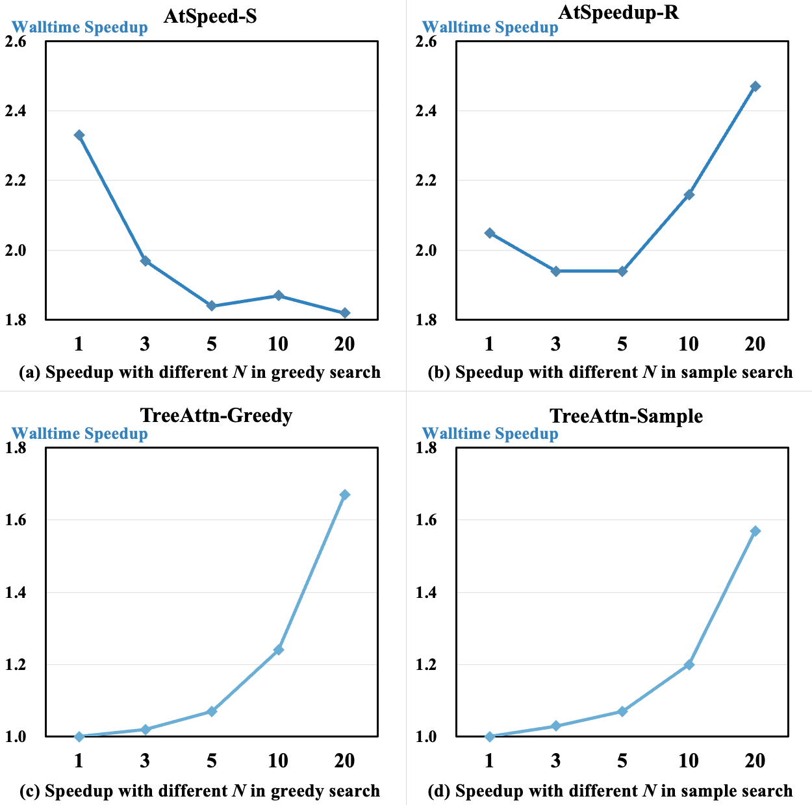

# AtSpeed
This is a Python package for accelerating the inference of Large Language Models (LLMs) by Speculative Decoding (SD), especially for Beam Search.


## Install
```bash
git clone xxx
cd AtSpeed
pip3 install -e .
```

## Easy to use

### :palm_tree: Enable tree attention for beam search

#### Approach 1: Replace transformers' beam search.
Only two lines of code are needed!
```python
from beamsd import replace_beam_search_with_TreeAttn

model = replace_beam_search_with_TreeAttn(model)
```
Then you can use `model.generate` as usual.
```python
outputs = model.generate(**inputs, max_new_tokens=32, num_beams=5)
```

#### Approach 2: Use atspeed's function.
```python
from atspeed.beamsd import beam_search_by_TreeAttn

outputs = beam_search_by_TreeAttn(model, inputs, max_new_tokens=32, beam_size=5)
```

### :sunny: Enable speculative decoding for beam search
It is recommended to set generation parameters in `model.generation_config` instead of passing them directly into the function `beam_search_by_SD`.

```python
target_model.generation_config.update(**{
    "max_new_tokens": max_new_tokens,
    "num_beams": beam_size,
    "num_return_sequences": beam_size,
})
draft_model.generation_config.update(**{
    "max_new_tokens": gamma,
    "num_beams": draft_beam_size,
    "num_return_sequences": draft_beam_size,
})

from atspeed.beamsd import beam_search_by_SD

outputs = beam_search_by_SD(target_model, draft_model, inputs)
```

### :alarm_clock: Enable timing component
```python
from atspeed.beamsd4timing import beam_search_by_SD_4timing

outputs = beam_search_by_SD_4timing(target_model, draft_model, inputs)
```
`beam_search_by_SD_4timing` provides precise timing for each module, and thus may take longer in total execution time than `beam_search_by_SD` due to the use of `torch.cuda.synchronize`.

For more details, please refer to [`demo.ipynb`](https://github.com/transcend-0/BeamSD/blob/master/demo.ipynb) or the source code.

## Acceleration Effect in Generative Recommendation


The experiment is conducted on Beauty dataset on an NVIDIA RTX A5000 GPU. target_model: LLaMA-7B, draft_model: LLaMA-68M, gamma=3, max_new_tokens=4, draft_beam_size=40, target_beam_size in {1,3,5,10,20}.

## Citation
The code in this repository is mostly developed for or derived from the paper below.
Please cite it if you find the repository helpful.

```
@article{lin2024efficient,
    title={Efficient Inference for Large Language Model-based Generative Recommendation},
    author={Lin, Xinyu and Yang, Chaoqun and Wang, Wenjie and Li, Yongqi and Du, Cunxiao and Feng, Fuli and Ng, See-Kiong and Chua, Tat-Seng},
    journal={arXiv preprint arXiv:2410.05165},
    year={2024}
}
```

We are also planning to add more of our research to this repository, such as the top-_K_ alignment between the draft model and the target model.
